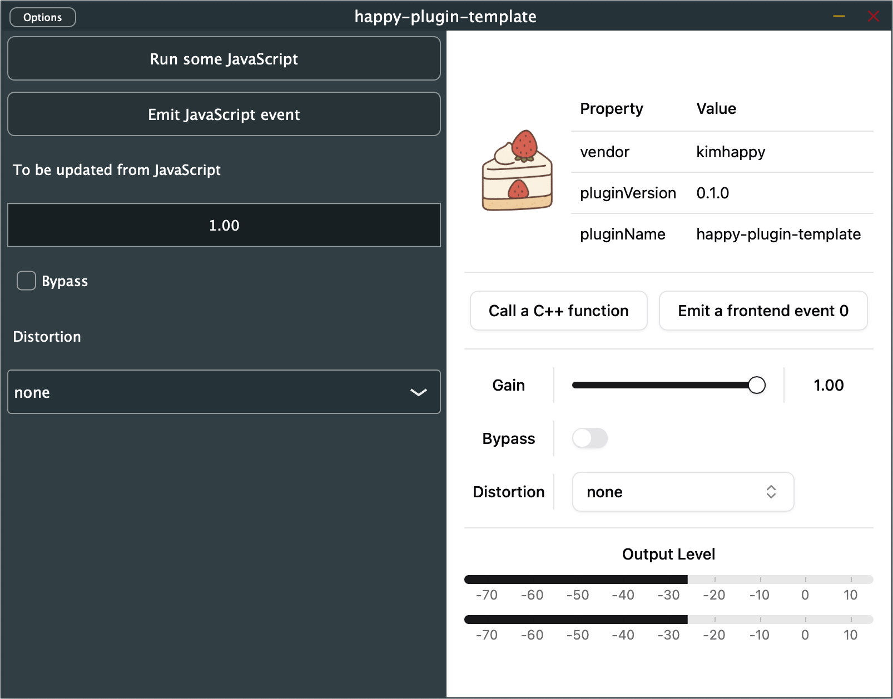

# Happy Plugin Template

<div align = 'center'>




</div>

**JUCE WebView** plugin project template.

## Build
```sh
bun b
```

| Option | Choices | Default | Description |
| - | - | - | - |
| `-d` | `Debug`, `Release` | `Debug` | C++ build mode. |
| `-s` | `live`, `bundle` | `live` | Whether to bundle WebView files into the binary or use live server. |
| `-v` | `hot`, `build` | `hot` if `-s` is `live`, `build` if `-s` is `bundle` | Whether to build WebView files or enable hot reloading. Cannot be `hot` when `-s` is `bundle`. |
| `-r` | | | Same as `-d release -s bundle -v build`. |
| `-f` | | | Remove CMake configuration directory in `/build` before building. |

> If you run `bun b` with the `-s live` option, the local server (http://localhost:3000) will be started.
> To run the app built with the `-s live` option, the local server must be running.
> You can specify the port number using the `HAPPY_PORT` environment variable.

## Add shadcn/ui components
```sh
bunx shadcn@latest add ...
```

## Clean up
```sh
bun z
```

## Related Links
- [happy-juce](https://github.com/kimhappy/happy-juce)
